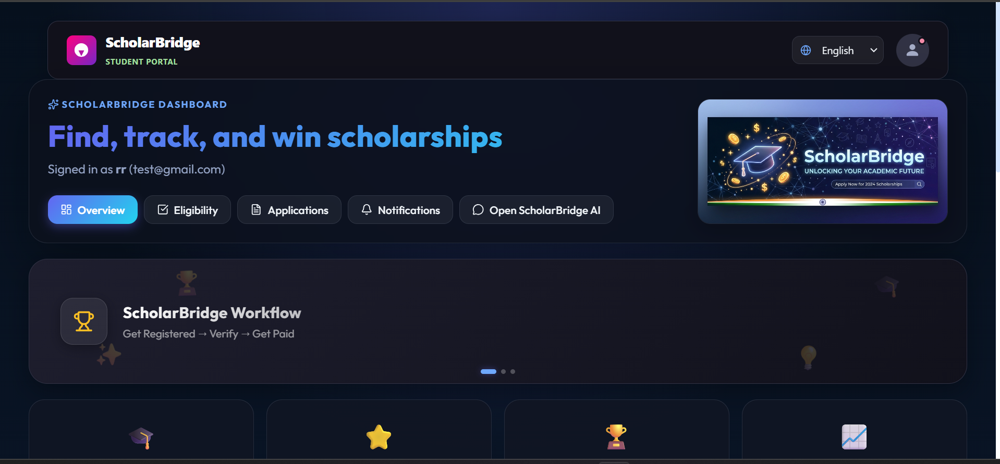
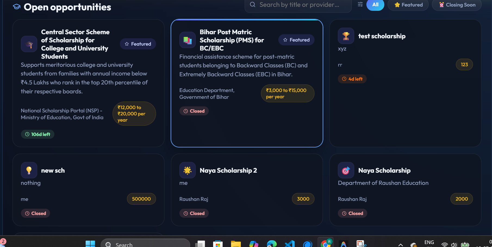
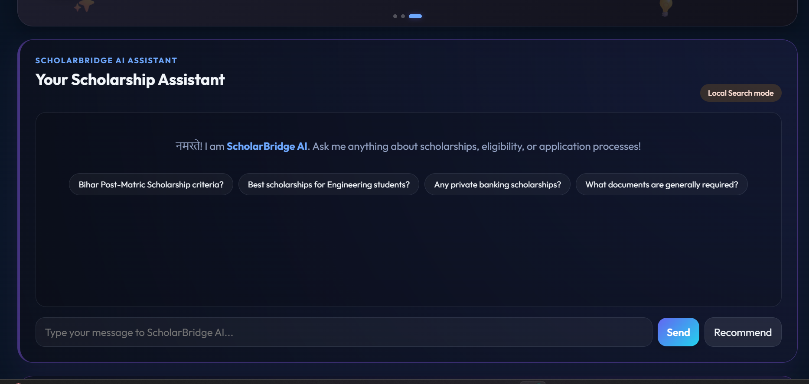
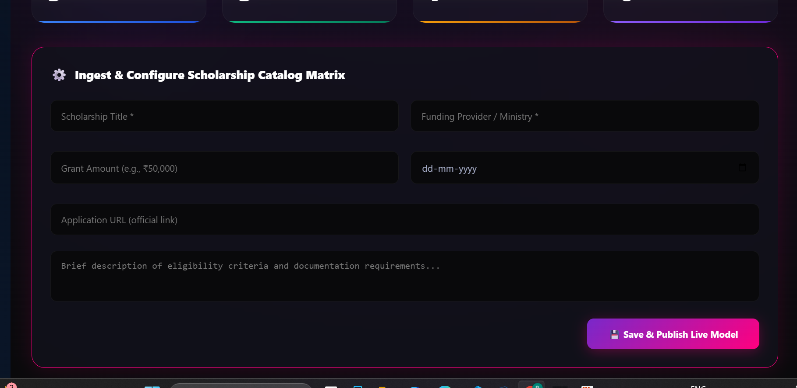

ScholarBridge — Full-stack scholarship product

This workspace contains a Node/Express backend and a Vite + React frontend.

Quick start (local):

1. Install backend and frontend dependencies from repository root:

```powershell
cd "C:\Users\rajra\OneDrive\Desktop\ScholarBridge"
npm run install-all
```

2. Start both servers in one terminal (root `dev` uses `concurrently`):

```powershell
npm install # at root to install concurrently
npm run dev
```

Or run servers separately:

```powershell
cd backend
npm install
npm run dev

cd ../frontend
npm install
npm run dev
```

Seed sample data:

```powershell
cd backend
npm run seed
```

Deploying:
- Frontend: deploy `frontend` to Vercel or Netlify (build with `npm run build`).
- Backend: deploy `backend` to Render, Heroku, or any Node host. Ensure `MONGODB_URI` and `JWT_SECRET` are configured. Set `AI_API_KEY` to enable AI features.

Features implemented:
- Auth (register/login/logout) with JWT in `httpOnly` cookie
- Scholarship listing and admin CRUD
- Scholarship detail and apply flow with file upload (stored under `backend/uploads`)
- AI chat and recommend endpoints (integrates with OpenAI-style API if `AI_API_KEY` is set)

Next tasks you can request:
- Add file upload to cloud storage (S3)
- Add richer frontend routing and styling
- Add tests and CI

## 📸 Screenshots

### Student Dashboard


### Open Opportunities


### Scholarship AI Assistant


### Admin Platform Control
